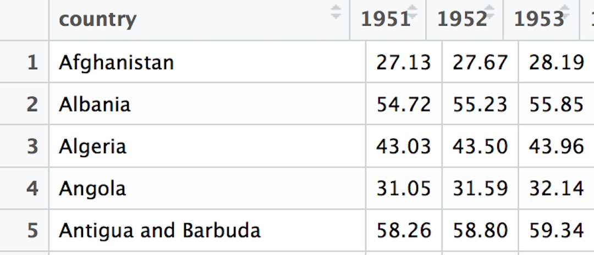
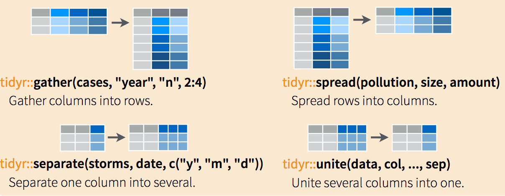
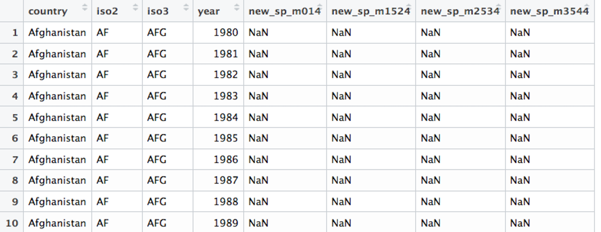

## Packages to install

I highly recommend you download and use [RStudio Desktop](https://www.rstudio.com/products/rstudio/download3/) if you aren't already.

Please copy the following commands into an R script and run in your RStudio Console:

```{r eval=FALSE}
dl_repo <- "http://cran.rstudio.org"
install.packages("tidyverse", repos = dl_repo)
install.packages("googlesheets", repos = dl_repo)
```

Note that you don't need to do this if you are using the [Reed College RStudio Server](https://rstudio-dev.reed.edu) as these are already installed there.

<br><br>

<small>Slides available at <http://bit.ly/reed-imp-tidy></small>

## What the `tidyverse` contains

For our work today, it includes the following R packages:

**IMPORT**

- `haven` for SPSS, SAS, and Stata data files
- `jsonlite` for JSON files
- `readxl` for XLS and XLSX files
- `readr` for CSV and TSV files (and R specific RDS files)

**TIDYING**

- `tidyr` for converting "messy" into "tidy" data frames

<small>Slides available at <http://bit.ly/reed-imp-tidy></small>

## Why am I here...?


<small>Slides available at <http://bit.ly/reed-imp-tidy></small>

## Basics of Importing

### Downloading the files

We will begin by downloading and importing a variety of different "messy" data sets.  You can download all of them in a ZIP file at <http://bit.ly/reed-messy-data>.  The links below go to the original sources.  I've converted these original sources into different formats.


- <small>[Life Expectancy by year for countries since 1951 (CSV)](https://spreadsheets.google.com/pub?key=phAwcNAVuyj2tPLxKvvnNPA&output=xls)
</small>
- <small>[World Health Organization TB data (Stata DTA)](http://www.who.int/tb/country/data/download/en/)
</small>
- <small>[Annual Estimates of Population by Age, Sex, Race, and Hispanic Origin for Oregon Counties (XLSX)](https://www.census.gov/popest/data/counties/asrh/2011/CC-EST2011-alldata.html)</small>
- <small>[Educational attainment for the U.S., States, and counties, 1970-2014 (JSON)](http://www.ers.usda.gov/data-products/county-level-data-sets/download-data.aspx)</small>
- <small>[County level results for 2012 POTUS election from The Guardian (SPSS SAV)](https://fusiontables.google.com/DataSource?docid=1qcQLqrAIAe3RcEfdWSm_QcXMLmteVg4uSpSs1rM)
</small>

<small>Slides available at <http://bit.ly/reed-imp-tidy></small>

## Demonstration

<small>Slides available at <http://bit.ly/reed-imp-tidy></small>

## Practice

- Download the four other files
- Import them into R using the appropriate package
    - You may need to check out the help pages for the different packages
        - [`haven` for SPSS, SAS, and Stata data files](http://haven.tidyverse.org/)
        - [`jsonlite` for JSON files](https://cran.r-project.org/web/packages/jsonlite/vignettes/json-aaquickstart.html)
        - [`readxl` for XLS and XLSX files](https://github.com/hadley/readxl)
        - [`readr` for CSV and TSV files (and R specific RDS files)](http://readr.tidyverse.org/)
    - Give them the following names: `who_df`, `county_pop_df`, `edu_county_df`, and `potus12_df`
  
<small>Slides available at <http://bit.ly/reed-imp-tidy></small>

## Tidying

### The Life Expectancy by year data

```{r include=FALSE}
# For the presentation the data is in a different location
life_exp_df <- readr::read_csv("../data/messy/le_mess.csv")
```

```{r eval=FALSE}
library(readr)
life_exp_df <- read_csv("le_mess.csv")
View(life_exp_df)
```

```{r echo=FALSE}

```

<small>Slides available at <http://bit.ly/reed-imp-tidy></small>

## Using the `tidyr` package

- Highly recommend downloading the RStudio Cheatsheets [here](https://www.rstudio.com/resources/cheatsheets/) and specifically the Data Wrangling one [here](https://www.rstudio.com/wp-content/uploads/2015/02/data-wrangling-cheatsheet.pdf)

```{r echo=FALSE}

```

<small>Slides available at <http://bit.ly/reed-imp-tidy></small>

## Doing the "tidying"/reshaping

```{r message=FALSE}
library(tidyr)
library(dplyr)
(life_exp_tidy <- life_exp_df %>% 
    gather(key = "year", value = "life_exp", -country))
```

<small>Slides available at <http://bit.ly/reed-imp-tidy></small>

## Tidying

#### World Health Organization TB data (Stata DTA)

```{r include=FALSE}
# For the presentation the data is in a different location
who_df <- haven::read_dta("../data/messy/who.dta")
```

```{r eval=FALSE}
library(haven)
who_df <- read_dta("who.dta")
View(who_df)
```

```{r echo=FALSE}

```

<small>Slides available at <http://bit.ly/reed-imp-tidy></small>

## WHO ugly... {.build}

- This data set contains strange variable names that will require us to look up their meaning in the corresponding [**data dictionary**](https://extranet.who.int/tme/generateCSV.asp?ds=dictionary).
- What do we know?
     - `country`, `iso2`, and `iso3` are redundant and identify the country
     - `year` is a variable and it looks like it corresponds to each country
- But what in the world is `new_sp_m014`? And the other columns?...

<small>Slides available at <http://bit.ly/reed-imp-tidy></small>

## First step

Like before, we can `gather` these non-`country` and non-`year` variables together:

```{r}
who_tidy <- who_df %>% 
  gather(new_sp_m014:newrel_f65, key = "key", value = "value")
```

We can now see what this has done to the data frame:

```{r eval=FALSE}
View(who_tidy)
```

<small>Slides available at <http://bit.ly/reed-imp-tidy></small>

## Data dictionary saves us some...

1. The first three letters of entries in the `key` column correspond to `new` or `old` cases of TB.
2. The next two letters (after the `_`) correspond to the type of TB:
    - `rel` for relapse, `ep` for extrapulmonary TB
    - `sn` for smear negative, `sp` for smear positive
3. The next letter after the second `_` corresponds to the sex of the TB patient.
4. The remaining numbers correspond to age group:
    - `014` for 0 to 14 years
    - ...
    - `65` for 65 or older

<small>Slides available at <http://bit.ly/reed-imp-tidy></small>

***

- Looking over the entries of `key` in `who_tidy`, do you see anything else that doesn't match the pattern?

- It may be easier to remember that the entries of `key` correspond to column names in `who_df`:

```{r}
names(who_df)
```

<small>Slides available at <http://bit.ly/reed-imp-tidy></small>

## A fix using `stringr`

You can replace all of the entries in `key` that contained `newrel` with `new_rel` via

```{r}
library(stringr)
library(dplyr)
who_tidy <- who_tidy %>% 
  mutate(key = str_replace(string = key, 
    pattern = "newrel", 
    replacement = "new_rel"))
```

<small>Slides available at <http://bit.ly/reed-imp-tidy></small>

## Pulling apart variables

The entry `new_sp_m014` is actually four different variables.  Use the `separate` function to pull them apart:

```{r}
who_tidy <- who_tidy %>% 
  separate(col = key, into = c("new", "type", "sexage"), sep = "_")
who_tidy
```


<small>Slides available at <http://bit.ly/reed-imp-tidy></small>

## One more pull apart

- We need to pull `sexage` into two different variables.  
- If you use `?separate`, you'll see that the following is an option:

```{r}
who_tidy <- who_tidy %>% 
  separate(col = sexage, into = c("sex", "age"), sep = 1)
who_tidy
```


<small>Slides available at <http://bit.ly/reed-imp-tidy></small>

## Final cleaning

- `iso2` and `iso3` are redundant if we have `country`
- `new` is constant since this only has new cases of TB
- Let's just ignore missing values here
- We also know that `value` is actually `cases` so we can `rename` that column.

```{r, tidy=FALSE}
who_tidy <- who_tidy %>% select(-iso2, -iso3, -new) %>% 
  na.omit() %>% rename("cases" = value)
head(who_tidy, 7)
```

<small>Slides available at <http://bit.ly/reed-imp-tidy></small>

## The power of the `%>%` (pipe)

Everything we did above can be chained into one sequence:


```{r eval=FALSE}
who_tidy <- who_df %>% 
  gather(new_sp_m014:newrel_f65, key = "key", value = "value") %>%  
  mutate(key = str_replace(key, pattern = "newrel", 
                           replacement = "new_rel")) %>% 
  separate(col = key, into = c("new", "type", "sexage"), sep = "_") %>% 
  separate(col = sexage, into = c("sex", "age"), sep = 1) %>% 
  select(-iso2, -iso3, -new) %>% 
  na.omit() %>% 
  rename("cases" = value)
```

<small>Slides available at <http://bit.ly/reed-imp-tidy></small>

## BONUS

#### A Gapminder tidy dataset read in from a Google Sheet!

- <small>I've updated the `gapminder` data set available in the `gapminder` R data package by Jenny Bryan [here](https://github.com/jennybc/gapminder/).  Jenny provides instructions for recreating the data [here](https://github.com/jennybc/gapminder/tree/master/data-raw).</small>

- <small>You can download the updated data from Google Sheets by running the following in R:</small>

```{r eval=FALSE}
# Link is https://docs.google.com/spreadsheets/d/18L5ZiXd1CQ97XWSqb04x1YQ4ncsEOdR7eHzgX0ZIuPA/edit?usp=sharing
updated_gap <- gs_key("18L5ZiXd1CQ97XWSqb04x1YQ4ncsEOdR7eHzgX0ZIuPA") %>%
  gs_read()
```


- <small>A script going through the steps to take the "messy" original Gapminder.org files and turn them into this tidy dataset is available [here](https://raw.githubusercontent.com/ismayc/tidyverse_workshops/master/importing_tidying/data/cleaning.R).</small>

<small>Slides available at <http://bit.ly/reed-imp-tidy></small>

## More practice

Try to tidy the other three data sets you downloaded and imported.


<small>Slides available at <http://bit.ly/reed-imp-tidy></small>

## Additional resources

- [`rio` R package](https://cran.r-project.org/web/packages/rio/vignettes/rio.html) 

- DataCamp Importing Tutorials
    * [This R Data Import Tutorial Is Everything You Need](https://www.datacamp.com/community/tutorials/r-data-import-tutorial)
    * [Importing Data Into R - Part Two](https://www.datacamp.com/community/tutorials/importing-data-r-part-two#gs.MNUMSHQ)

- [R for Data Science](http://r4ds.had.co.nz/)
    * Chapter [11](http://r4ds.had.co.nz/data-import.html) on Importing Data
    * Chapter [12](http://r4ds.had.co.nz/tidy-data.html) on Tidying Data

<small>Slides available at <http://bit.ly/reed-imp-tidy></small>

## Thanks!

- All workshop materials available [here](https://github.com/ismayc/tidyverse_workshops)
- Slides available [here](https://htmlpreview.github.io/?https://github.com/ismayc/tidyverse_workshops/blob/master/importing_tidying/slides/slides.html#/)
    
---

```{r comp_info}
sessionInfo()
```

